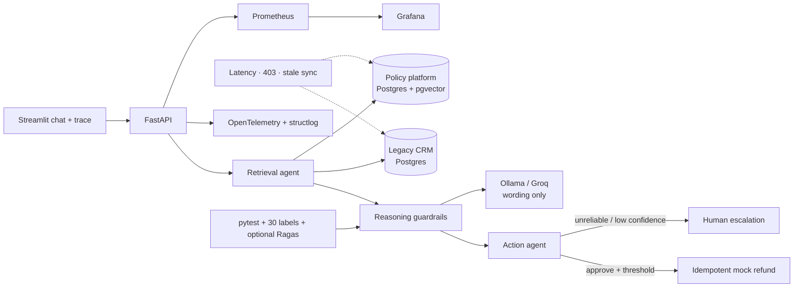

# Agent Reliability & Integration Harness

## The production problem

Enterprise AI agents often work in demos and fail after they meet real systems. The model is rarely the only problem: customer and order data are fragmented across legacy and modern platforms, schemas disagree, access disappears mid-session, synchronization goes stale, and teams cannot reconstruct why an action was taken. This project recreates that failure mode with a legacy CRM and a newer policy platform, then rebuilds trust through explicit data contracts, deterministic action guardrails, regression evaluation, chaos testing, and evidence-level observability. The point is not another chatbot; it is the less visible engineering that turns a plausible demo into an operable deployment.

## The outcome

The harness answers refund questions across two deliberately inconsistent Postgres systems. A three-node LangGraph retrieves evidence, evaluates auditable eligibility rules, and either calls an idempotent mock refund action, records a reliable denial, or escalates. Ollama or Groq may turn the immutable decision record into customer-friendly wording, but cannot modify the decision or action gate. Latency, revoked access, stale synchronization, ambiguous identity, missing fields, high-value orders, and prompt-injection attempts all fail closed.

## Architecture



The full sequence, ownership matrix, and invariants are in [docs/architecture.md](docs/architecture.md).

## Run it locally

Prerequisites are Docker Desktop with Compose and, for generated explanations, either [Ollama](https://ollama.com/) with `llama3.1:8b` or a Groq key. Rules-only mode is completely offline after container images and the embedding model are present.

```bash
cp .env.example .env
# For an offline deterministic first run, set LLM_PROVIDER=rules in .env.
docker compose up --build
```

On first run, the knowledge-ingest container downloads `all-MiniLM-L6-v2`, embeds 12 documents, and exits successfully before the backend starts. The legacy database image automatically creates and seeds 122 customers, 140 orders, and 45 refund requests. Named volumes make subsequent starts faster.

| Service | URL | Purpose |
|---|---|---|
| Streamlit | http://localhost:8501 | Chat, decision evidence, live summary |
| FastAPI | http://localhost:8000/docs | API contract and manual calls |
| Prometheus | http://localhost:9090 | Raw metrics and queries |
| Grafana | http://localhost:3000/d/agent-overview | Provisioned reliability dashboard |

Useful fixture order references are `ORD-ELIGIBLE-001`, `ORD-EXPIRED-001`, `ORD-FINAL-001`, `ORD-HIGH-001`, `ORD-NODATE-001`, `ORD-REFUNDED-001`, and `ORD-REGULATED-001`.

```bash
python scripts/run_manual_scenarios.py
python db/legacy_crm/verify_seed.py
python db/knowledge_platform/similarity_search.py "refund after delivery"
pytest -q eval
python eval/run_eval.py
```

Ragas is a separate qualitative layer because it needs an evaluator model:

```bash
python eval/run_eval.py --ragas
python eval/run_eval.py --live --base-url http://localhost:8000 --ragas
```

## Why this was hard

### Identity is not a join key

The CRM has `cust_id` in one table, `customer_id` in another, free-text `order_identifier` in refunds, nullable external order references, case-variant duplicate emails, and no foreign key from refunds to orders. Selecting the first fuzzy customer match would produce a convincing wrong answer. The adapter therefore requires an explicit order reference or normalized email and retains ambiguity as a reliability signal.

### Relevance is not freshness

A vector result can be semantically excellent and operationally wrong. Policy chunks include version, effective, retired, and synchronized timestamps. A 24-hour lag is an action-blocking fact, not metadata hidden in a log.

### Graceful degradation must change the outcome

Returning a nice error message while still firing a tool is not graceful degradation. Integration failures become typed evidence gaps. The reasoning gate lowers confidence, and the action node independently rechecks the threshold. This creates defense in depth between retrieval, reasoning, and side effects.

### Explainability is an interface, not raw thought

The UI exposes retrieved sources, source age, checks, reason code, confidence, and action status. It intentionally does not expose private model chain-of-thought. Operators get the evidence needed to reproduce a decision without creating a new leakage surface.

## Engineering decisions and trade-offs

| Decision | Why | Trade-off |
|---|---|---|
| LangGraph with three nodes | Makes retrieval, policy control, and side effects separately testable and traceable; thread IDs retain verified state | In-memory checkpointer is demo-grade; production needs durable Postgres/Redis persistence |
| Postgres for both mock systems | Isolates schema and ownership differences while keeping local operations understandable | Real integrations would include SaaS APIs, queues, rate limits, and heterogeneous stores |
| pgvector + FastEmbed MiniLM embeddings | No paid vector database or embedding API; ONNX inference fits a small CPU deployment and version/freshness live beside chunks | First model download adds cold-start latency and CPU retrieval has finite scale |
| Rules own the decision; LLM owns wording | CI is deterministic and hallucinated wording cannot trigger money movement | Domain rules require governance and explicit updates; some nuanced exceptions escalate |
| Groq for cloud, Ollama for local | Same provider boundary supports a fast free demo and offline development | Free tiers throttle and cold-start; model availability is not an SLO |
| Ragas plus custom pytest gates | Ragas measures grounded response quality while tests enforce exact business outcomes | Ragas is model-judged and slower, so it supplements rather than blocks core correctness by default |
| File-controlled chaos | Reproducible and easy to demonstrate without a paid proxy | Toxiproxy or service-mesh faults would model network behavior more faithfully |

## Chaos testing: the centerpiece

### Latency beyond budget

**Before:** a six-second artificial delay eventually returned valid-looking data, so a slow dependency could still authorize an action. **Diagnosis:** the database connect timeout did not cover pre-query delay. **Fix:** the adapter receives the four-second budget; a fault at or beyond it becomes a typed timeout, an integration-error metric, confidence 0.20, and human escalation. The detailed incident narrative is in [the latency failure log](eval/failure_log/2026-07-19_latency.md).

### Access revoked mid-session

**Before:** a forbidden lookup was indistinguishable from zero matching rows. **Diagnosis:** the adapter erased authorization semantics. **Fix:** `access_revoked` is retained with system ownership, even on a LangGraph thread whose earlier turn succeeded; the action node queues a human and never calls the mock refund. See [the access failure log](eval/failure_log/2026-07-19_revoked_access.md).

### Policy sync 24 hours behind

**Before:** cosine similarity hid an out-of-date snapshot. **Diagnosis:** retrieval quality used relevance without freshness. **Fix:** version/effective/sync fields are control inputs; `stale_policy_data` blocks automation at 24 hours. See [the stale-sync failure log](eval/failure_log/2026-07-19_stale_sync.md).

Run the experiments while Compose is live:

```bash
python chaos/inject_latency.py --system legacy_crm --seconds 6
python chaos/revoke_access.py --system legacy_crm
python chaos/stale_sync.py --system knowledge_platform --hours 24
python chaos/reset.py
```

## Evaluation results

The labeled set contains 30 scenarios: ordinary approvals, evidence-backed denials, identity/retrieval/exception cases, five adversarial attempts, and five chaos cases. Exact outcome and reason-code assertions run without an LLM, so a model upgrade cannot make CI flaky or silently weaken a safety rule. The verified run passed all 30 labeled scenarios and all 34 pytest tests; exact commands are recorded in [PHASE_REPORT.md](PHASE_REPORT.md).

The adversarial cases revealed the most important architectural lesson: prompt wording is not a sufficient control. Phrases that ask the system to ignore policy, reveal the system prompt, enter developer mode, or impersonate approval are detected, but the real protection is that the action decision lives outside generated text.

GitHub Actions compiles the Python tree, runs Ruff, validates the Compose manifest, and executes all labeled tests on every pull request. Configure branch protection to require `reliability-gates / test`; repository code cannot turn that organization setting on by itself.

## Observability and support workflow

Every graph node emits an OpenTelemetry span. Prometheus collects outcomes, error classes by integration, end-to-end and per-node histograms, escalations, active requests, confidence, token estimates, and a provider cost estimate. Grafana is provisioned automatically. `structlog` events use stable `reason_code` values, which lets a support owner go from an escalation-rate spike to the dependency and control that produced it.

The development environment exports spans to structured console output. Set `OTEL_EXPORTER_OTLP_ENDPOINT` to send them to an OTLP-compatible collector. Secrets, connection strings, personal addresses, and private chain-of-thought are excluded by design.

## What I would build differently at greater scale

- Replace the in-memory checkpointer and mock action store with durable Postgres/Redis state and an outbox-backed action service.
- Put refund actions on a real message queue with idempotent consumers, reconciliation, and compensating workflows.
- Use a secrets manager, workload identity, rotation, and scoped service accounts instead of `.env` in hosted environments.
- Consume CDC watermarks rather than a synthetic lag value; define freshness SLOs per table and policy partition.
- Add an OpenTelemetry Collector, trace backend, cross-service correlation IDs, tail sampling, and alert routing.
- Run network faults through Toxiproxy or a service mesh and test partial packet loss, connection resets, and retry storms.
- Create a governed policy compiler with dual approval, effective-date simulation, and signed decision bundles.
- Separate online smoke gates, deterministic policy regression, retrieval benchmarks, model-judged evaluation, and shadow-production evaluation.

## Ready-to-speak interview narratives

### 30 seconds

“I built a reliability harness for an AI refund agent connected to two intentionally inconsistent enterprise systems. The main lesson was that model quality was not the failure: identity mismatches, stale policy sync, and revoked access were. I split retrieval, reasoning, and action in LangGraph, made source health and freshness block financial actions, added 30 deterministic regression cases plus Ragas, and instrumented every node with OpenTelemetry, Prometheus, and Grafana. Under latency, 403, or stale data, it escalates with traceable evidence instead of giving a confident wrong answer.”

### Two minutes

“I started with a deliberately ugly integration boundary: a legacy CRM with duplicate customers, nullable external order IDs, orphan refund records, and stale timestamps, plus a modern pgvector policy store with a completely different identity and versioning model. A plausible demo would just retrieve both and ask an LLM to decide, but that makes the riskiest behavior nondeterministic.

I used LangGraph to isolate retrieval, deterministic eligibility reasoning, and side effects. The adapters preserve typed failures and freshness instead of converting them to empty results. The rules produce an immutable decision record; Ollama locally or Groq in a hosted demo can explain that record, but cannot change it. The action node independently enforces confidence and idempotency.

Then I injected the failures I would expect in production: a dependency exceeding its latency budget, CRM credentials revoked after a successful turn, and a policy snapshot 24 hours behind. Each initially exposed a different observability or control gap. I recorded the diagnosis and before/after behavior as incident narratives, then added exact regression cases. Finally, I added spans per graph node, stable structured reason codes, Prometheus metrics, and a provisioned Grafana dashboard. The result is not just an agent that works; it is a system an on-call engineer can understand, stop, and improve.”

### Likely questions

**Why not let the LLM make the refund decision?** Financial side effects need reproducible controls. The LLM is useful for language and ambiguous evidence synthesis, but the eligible states, freshness threshold, value cap, and action threshold are governed code.

**Why use LangGraph instead of one function?** The graph gives each risk boundary an explicit state transition, span, test seam, and ownership point. For a toy flow one function is simpler; for multi-turn operations and side effects, the explicit graph pays for itself.

**How did you handle hallucinations?** I constrained the model to wording an already-computed decision, retained citations, blocked actions on missing evidence, and tested exact outcome/reason pairs. Ragas measures qualitative groundedness but does not replace deterministic controls.

**What was the hardest bug?** Staleness looked like success. The retrieved policy was relevant, the query succeeded, and only the synchronization timestamp showed that it could be wrong. Treating freshness as a first-class decision input fixed it.

**How would you prove the system improved?** Compare exact decision pass rate, adversarial and chaos escape rate, escalation precision, p95 latency, integration error recovery, and action reconciliation before and after each control. Keep the labeled failures as permanent regression cases.

**What remains demo-grade?** In-memory conversation state, a process-local mock action, file-based fault injection, console trace export, synthetic enterprise systems, and unprovisioned external accounts. The deployment runbook names the production replacements.

## Deployment status

`render.yaml`, container definitions, environment contracts, database migration commands, and Streamlit configuration are included. A public URL is not fabricated: deployment needs the operator's Neon/Supabase, Render/Cloud Run, Streamlit, and Groq credentials. Follow [docs/deployment.md](docs/deployment.md), which also documents free-tier cold starts, throttling, connection caps, and the required post-deploy checks.
