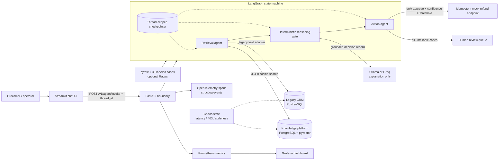
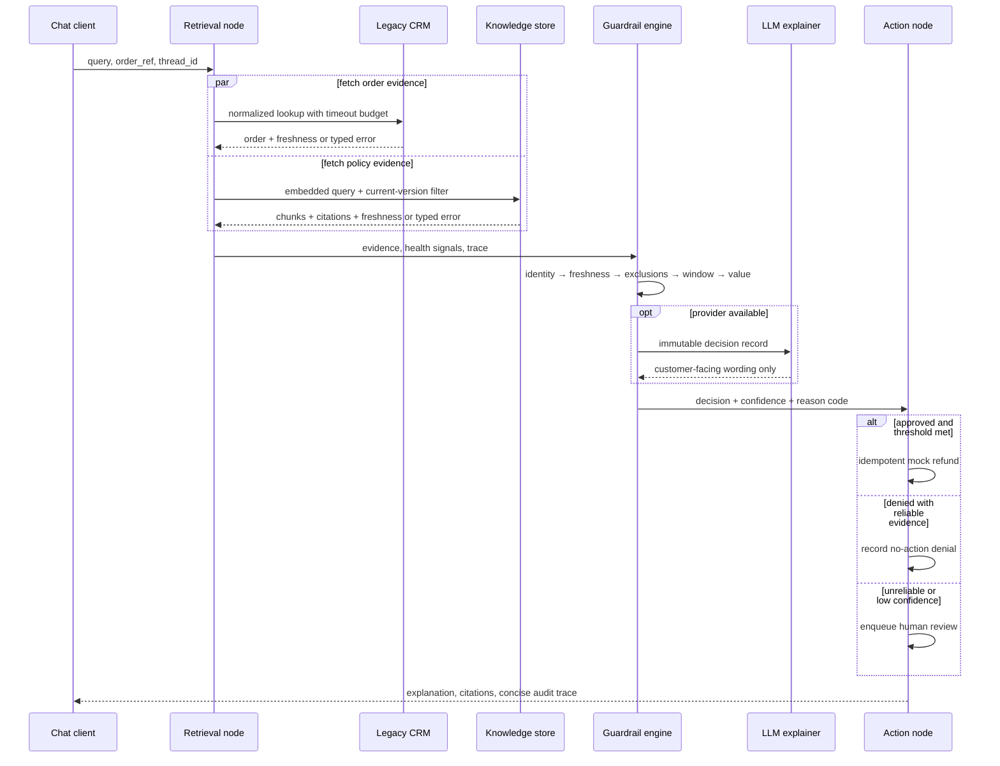

# Architecture

## System view

## Ownership and schema boundaries

| Concern | Authoritative system | Deliberate mismatch | Adapter behavior |
|---|---|---|---|
| Customer identity | Legacy CRM | `cust_id`, `email_addr`, duplicate rows | Requires order ref or normalized email; never name-only matching |
| Order identity | Legacy CRM | `ord_pk` plus nullable `order_ref` | Carries both identifiers and treats missing refs as an escalation signal |
| Refund history | Legacy CRM | Free-text `order_identifier`, no foreign key | Checks text reference and does not assume orphaned rows are harmless |
| Policy | Knowledge platform | UUID/document key, version/effective/sync timestamps | Retrieves chunks semantically and propagates version/freshness |
| Conversation | LangGraph checkpointer | External thread id | Retains verified identifiers across follow-ups |
| Financial action | Action node | Not available to the LLM | Requires `approve_refund` and confidence at/above threshold |

## Decision sequence

## Observability contract

Every node creates an OpenTelemetry span named `agent.<node>`. Attributes contain decision metadata, counts, confidence, and action status—not customer secrets or private model reasoning. Prometheus captures request outcomes, integration error class, node and end-to-end latency histograms, escalations, token estimates, active requests, and provider cost estimate. Structured logs use the same stable reason codes, enabling a support engineer to move from a dashboard spike to the exact failing dependency.

## Reliability invariants

1. No integration error becomes an empty successful result.
2. No financial action occurs without authoritative order evidence and current policy evidence.
3. Data lag of 24 hours or more forces escalation.
4. LLM output cannot alter decision, confidence, reason code, citations, or action gating.
5. Repeated approved actions use the order reference as an idempotency key.
6. The user-visible trace contains evidence and control outcomes, not hidden chain-of-thought.

